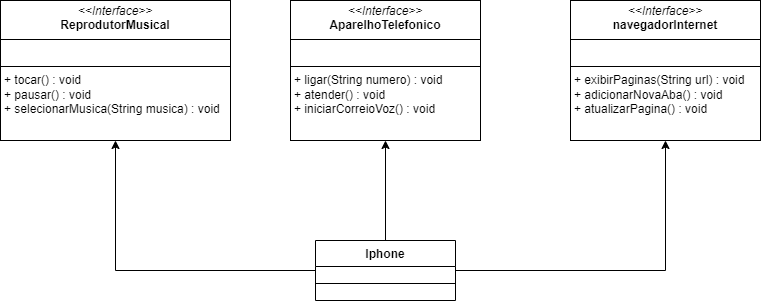

# 📋 DESAFIO DIO SANTANDER 2024 JAVA

Desafio de projeto para modelagem e criação de um componente iphone.

O objetivo principal desse projeto é colocar em pratica o que foi absovido nessa etapa do bootcamp.
logo abaixo temos o diagrama UML representando as funcionalidade(Reprodutor Musical, Aparelho telefonico e navegador internet) do iphone, implementando classes e interfaces.

## 📊 Diagrama UML

  

#### Funcionalidades:

1. **Reprodutor Musical**
   - Métodos: `tocar()`, `pausar()`, `selecionarMusica(String musica)`
2. **Aparelho Telefônico**
   - Métodos: `ligar(String numero)`, `atender()`, `iniciarCorreioVoz()`
3. **Navegador na Internet**
   - Métodos: `exibirPagina(String url)`, `adicionarNovaAba()`, `atualizarPagina()`
